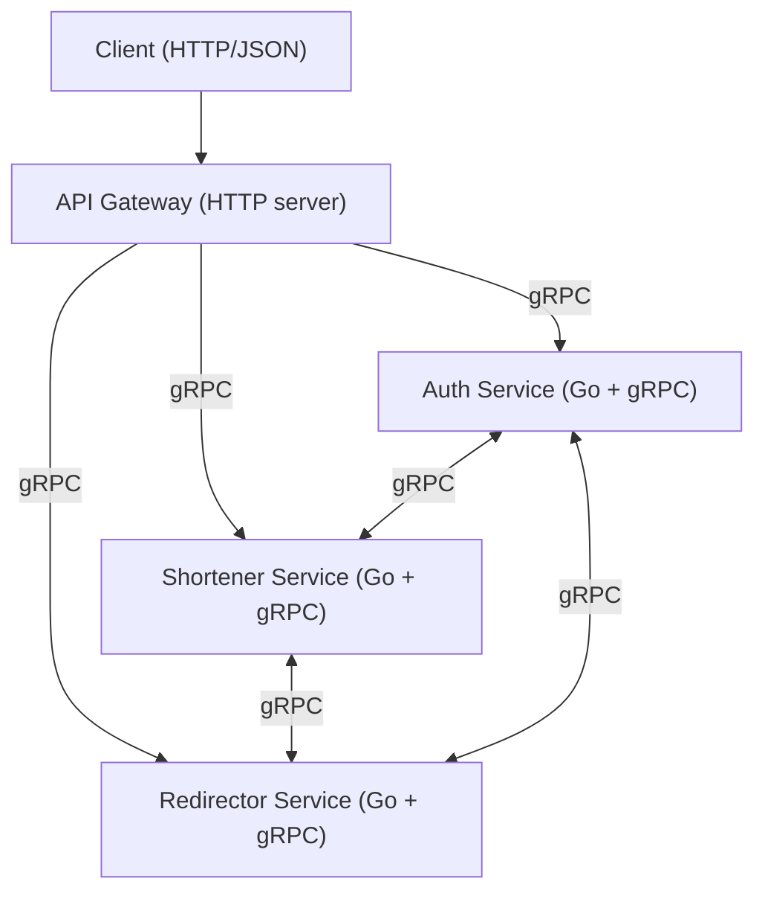

## Architecture Diagram




## Install protobuf

```bash
brew install protobuf
```

## Install go
```bash
brew install go
```


## Install bun
```bash
curl -fsSL https://bun.sh/install | bash 
```

